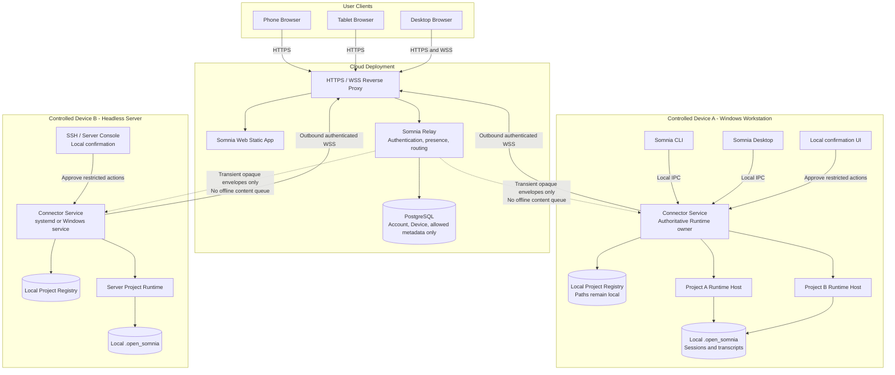
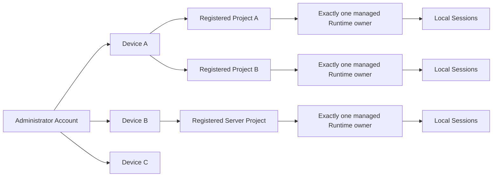

# Remote Somnia Web Control

**Status:** ready-for-agent

## Problem Statement

Somnia sessions currently run on a user's computer and are primarily controlled through Somnia Desktop. A user who moves between a desktop browser, phone, or tablet cannot securely reach those sessions over the internet without exposing a local sidecar, configuring the network, or keeping the Desktop interface in front of them. The user needs a hosted Web interface that can switch between registered computers and projects, preserve the complete Somnia Desktop conversation experience, and stream active Runtime output with low latency. The hosted system must not persist prompts, responses, tool data, session history, or transferred files in the cloud.

## Solution

Provide a responsive Somnia Web application backed by a cloud Relay and a persistent computer-side Connector. The Connector makes an outbound authenticated WebSocket connection to the Relay, owns the registered project Runtimes on that computer, and remains available when Somnia Desktop is closed. An authenticated browser selects an online Device and Project, then uses the Relay as a transparent bidirectional channel to the Connector.

The Relay stores only account, device identity, device public key, non-sensitive project identity, and online metadata. Conversation content passes through process memory only and is excluded from databases, queues, logs, traces, metrics, and crash reports. Session storage remains authoritative on the computer. The Connector provides event sequencing, bounded in-memory replay, idempotent commands, and snapshot recovery so transient network failure does not duplicate questions or corrupt the visible conversation.

Somnia Desktop and Somnia Web share the same conversation domain logic and connect through a small Somnia Connection interface. Direct and remote adapters must satisfy the same behavioral contract. Web layouts may differ for mobile ergonomics, but conversation capabilities and state transitions must match Desktop except for intentionally restricted high-risk actions.

## Controlled Runtime Architecture

### Ownership and routing model

Architecture invariants:

- The Relay and Web deployment are the cloud control plane; the Relay never owns a Somnia Runtime.
- Every controlled computer runs an outbound Connector service. No Sidecar or Runtime port is exposed to the internet.
- The Connector is the sole Runtime owner for every registered Project on its Device. CLI, Desktop, and Remote Web are clients of that ownership boundary rather than competing Runtime owners.
- A headless server is a normal Device. It runs the Connector and registered Runtime hosts without keeping an interactive CLI terminal open.
- Project paths, provider secrets, Session state, transcripts, and Runtime artifacts remain on the controlled Device.
- PostgreSQL stores only the explicitly allowed account, Device, public-key, Project identity, and presence metadata.
- Conversation-bearing frames exist in Relay process memory only while being forwarded. Offline Devices receive immediate errors rather than durable queued commands.
- The remote channel is fully authorized for paired, non-revoked Devices: permission approval (including persistence), sensitive configuration (all sections, hooks included), and Yolo activation are allowed remotely.

## User Stories

1. As the administrator, I want to sign in securely, so that only I can access my computers.
2. As the administrator, I want to pair a computer with a short-lived code or QR flow, so that long-lived credentials are never typed into a browser.
3. As the administrator, I want to name, inspect, and revoke a Device, so that lost or retired computers immediately lose access.
4. As a user, I want to see which Devices are online, reconnecting, or offline, so that I know where work can be controlled.
5. As a user, I want to switch Devices without signing in again, so that managing several computers is efficient.
6. As a user, I want to see the Projects registered on an online Device, so that I can choose the correct workspace.
7. As a user, I want Project paths to remain private to the computer, so that the Relay does not learn sensitive filesystem structure.
8. As a user, I want the Connector to remain online while Desktop is closed, so that remote access is dependable.
9. As a user, I want each Project to have one managed Runtime owner, so that Desktop and Web cannot race over the same persisted state.
10. As a user, I want to list, open, create, archive, restore, and permanently delete sessions, so that remote session management matches Desktop.
11. As a user, I want the complete authoritative session history loaded from the computer, so that the Relay does not need a cloud copy.
12. As a user, I want Markdown, code blocks, Mermaid, images, and tool images rendered consistently, so that technical output remains useful on every device.
13. As a user, I want assistant text to appear incrementally, so that remote interaction feels as immediate as Desktop.
14. As a user, I want to see thinking state, tool starts and finishes, Todo changes, context usage, subagents, teammates, and task progress in real time, so that I can monitor work rather than only wait for final text.
15. As a user, I want to inspect tool, worker, team, and task details, so that remote progress has the same diagnostic depth as Desktop.
16. As a user, I want to send a new question to an idle session, so that I can continue work remotely.
17. As a user, I want a question submitted during an active Turn to follow Desktop queue and loop-injection behavior, so that it is not lost or executed twice.
18. As a user, I want to interrupt an active Turn, so that I can stop unwanted work promptly.
19. As a user, I want slash commands, project path mentions, prompt history, and image input, so that the composer retains Desktop conversation capabilities.
20. As a user, I want session compaction and janitor operations, so that long-running sessions can be maintained remotely.
21. As a user, I want provider, model, vision model, and reasoning controls exposed where Desktop exposes them, so that remote conversations use the intended model configuration.
22. As a user, I want existing per-Project and per-Session concurrency rules preserved, so that remote access cannot bypass Runtime safety.
23. As a user, I want pending authorization and mode-switch interactions displayed, so that I know why a Turn is waiting.
24. As the administrator, I want full remote authority — permission approval, sensitive configuration, and Yolo — to be available only through an authenticated, paired, non-revoked Device, so that pairing and revocation remain the single control point for remote machine control.
25. As the administrator, I want hooks and every other configuration section editable remotely for verified Devices, so that remote settings management has no visible difference from Desktop.
26. As a user, I want the browser to recover after Wi-Fi changes, mobile suspension, or Relay restart, so that an active session remains understandable.
27. As a user, I want missed events replayed when available and a snapshot resync otherwise, so that reconnects never leave a silently incomplete view.
28. As a user, I want repeated network delivery of a command to remain idempotent, so that a question or destructive action runs only once.
29. As a user, I want several authenticated browsers to observe the same session, so that I can move between devices without closing the first one.
30. As a user, I want conflicting commands to receive explicit errors, so that concurrency never produces ambiguous state.
31. As the administrator, I want the Relay to reject content-bearing commands while a Device is offline, so that it never becomes an offline content queue.
32. As the administrator, I want logs, traces, metrics, and error reports scrubbed of conversation payloads, so that operational tooling cannot accidentally retain session data.
33. As a mobile user, I want navigation, progress, and composing optimized for a small screen, so that capability parity does not require a desktop layout.
34. As a desktop browser user, I want an information-dense multi-column layout, so that monitoring several projects remains efficient.
35. As a user, I want archived-session state and prompt history to remain local to each browser, so that the Relay does not store session-derived preferences.

## Implementation Decisions

- The first release supports one administrator account with multiple authenticated browsers and multiple Devices.
- A Device is a computer running a Connector. Pairing establishes a Device-specific asymmetric identity that can be independently revoked and rotated.
- Browsers use short-lived access tokens. Connectors authenticate by signing server challenges with their Device key.
- Transport security is HTTPS and WSS. End-to-end payload encryption is deferred; the Relay may see transient plaintext while forwarding it but must not retain it.
- The Relay persists only administrator identity, Device identity and name, Device public key, non-sensitive Project identity and name, and connection timestamps. It does not persist workspace paths, Session identifiers, conversation content, files, or commands.
- Content-bearing traffic is never placed in a durable broker, job queue, dead-letter queue, cache, analytics system, or error-reporting system.
- The Relay is a routing module, not a Somnia domain implementation. It authenticates endpoints, enforces routing and limits, and forwards opaque versioned envelopes.
- The Connector is the authoritative remote endpoint and Runtime owner for its Device. It can run independently of Desktop and manages multiple registered Projects.
- A Project folder is registered locally. Remote clients may select and operate registered Projects but may not browse the computer filesystem or register an arbitrary path.
- Desktop and Web use a shared Somnia Connection seam with direct and remote adapters. Conversation state reduction, event interpretation, and message rendering are shared rather than reimplemented.
- Desktop and Remote Web converge on a single UI tree (`App.tsx`); `RemoteTracerApp` is retired. Remote mode hides Project creation/removal and local-only chrome, and selects Projects only from the paired Device's registered list (issue 14).
- Protocol envelopes carry a protocol version, Device and Project identity, optional Session and Turn identity, request identity, stream epoch, sequence number, message type, and payload.
- Mutating commands require a unique request identity. The Connector maintains a bounded deduplication window and returns the original result for safe retries.
- The Connector assigns ordered event sequence numbers and retains a bounded in-memory event ring for active streams. The browser acknowledges the highest contiguous sequence it has applied.
- After reconnection, the browser requests replay after its last acknowledged sequence. If replay is unavailable, it reloads authoritative Session and Runtime snapshots before resuming live events.
- Completed Session state on the computer is authoritative. In-progress presentation state may be reconstructed from the Connector's in-memory active-turn snapshot.
- The Relay does not buffer disconnected-browser events. Slow clients are disconnected with a resynchronization reason rather than applying backpressure to a Runtime.
- Device-offline commands fail immediately. The browser may retain an unsent local draft, but automatic remote submission waits for explicit user action after reconnection.
- Multiple browsers may observe and command the same Device. Existing Runtime concurrency rules and command idempotency resolve contention.
- Remote conversation behavior matches Desktop, including queued prompts, loop injection, interruption, compaction, janitor, attachments, rich output, activity views, and model controls.
- Remote clients may approve tool authorization (including persistent grants), change sensitive provider, MCP, and hooks configuration, and enable Yolo, provided the channel runs through an authenticated, paired, non-revoked Device.
- Session archive state and prompt history remain browser-local because the Relay may not store Session-derived data.
- The responsive Web application uses mobile-first navigation without requiring visual identity with Desktop. Capability and state-transition parity are the acceptance target.
- The initial deployment is a single Relay node backed by PostgreSQL for allowed metadata. Horizontal scaling and a non-content presence broker may be added only after preserving the no-content-persistence invariant.

## Testing Decisions

- The highest behavioral test seam is Somnia Connection. The same contract suite runs against direct and remote adapters.
- Tests assert observable commands, events, snapshots, errors, ordering, and recovery behavior rather than internal classes or private helper calls.
- Shared conversation-state tests feed identical event streams through Desktop and Web consumers and require identical domain state.
- Connector contract tests cover Project ownership, Runtime lifecycle, sequence assignment, acknowledgements, replay windows, snapshot fallback, deduplication, and concurrent clients.
- Relay integration tests use real WebSocket clients on both sides and cover authentication, pairing, routing, revocation, Device isolation, payload limits, slow consumers, and abrupt disconnects.
- Privacy tests inspect the Relay database, application logs, access logs, traces, metrics labels, exception reports, and temporary files after representative conversations and require that no prohibited content appears.
- End-to-end tracer tests cover sign-in, pairing, Project selection, Session creation, streaming response, tool activity, continuation, interruption, browser reconnection, and Relay restart.
- Fault tests cover duplicated frames, reordered or missing frames, Connector restart, Relay restart, browser suspension, mobile network changes, offline Devices, and expired credentials.
- Existing AppService and sidecar regression tests remain part of the required suite.
- Browser tests use Playwright at phone, tablet, laptop, and wide-desktop viewports and verify layout, scroll anchoring, composer stability, image rendering, and absence of overlapping controls.
- Load and soak tests include long responses, large tool results, multiple simultaneous observers, the existing per-Project Turn limit, and slow browser connections.
- Security verification covers token expiry, key rotation, Device revocation, cross-Device routing attempts, request replay, unauthorized dangerous operations, origin policy, and redaction failures.

## Out of Scope

- Multi-user registration, organizations, roles, sharing, and collaboration between different accounts.
- Cloud persistence or synchronization of Session history, Session search, archived state, drafts, or prompt history.
- End-to-end encryption that prevents the Relay process from seeing transient plaintext.
- Offline command queues and delayed execution while a Device is disconnected.
- Remote filesystem browsing or arbitrary remote Project registration.
- Remote access for unpaired or revoked Devices (device verification is the security gate for all remote authority).
- Native Android or iOS applications; the first client is a responsive hosted Web application.
- Horizontal Relay scaling until the single-node reliability and privacy invariants are proven.

## Further Notes

- The no-content-persistence rule applies to indirect copies such as reverse-proxy logs, observability exporters, request sampling, database diagnostics, crash dumps, and support bundles.
- "Same as Desktop" means conversation capabilities and state transitions, not pixel-identical layout or unrestricted remote machine authority.
- The first implementation should use a narrow end-to-end tracer before migrating the complete Desktop feature set.
- Durable protocol, Connector ownership, and no-content-persistence choices are candidates for ADRs once implementation constraints validate the selected design.
