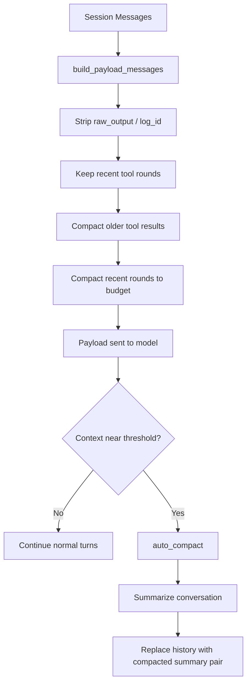
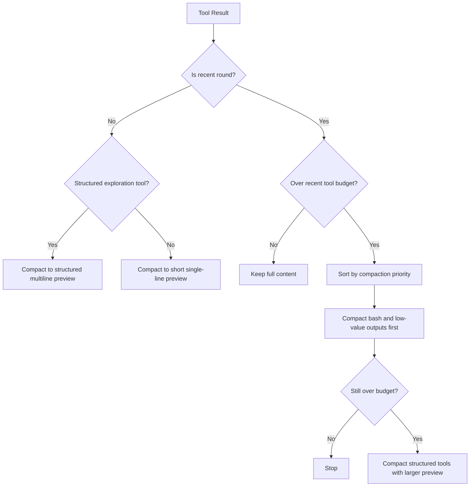
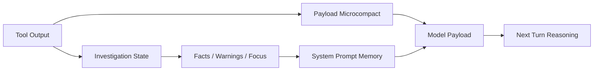

# 12 - 压缩策略

## 目标

Somnia 的压缩策略分成两层：

1. `payload microcompact`
2. `auto compact`

两者解决的是不同问题：

- `payload microcompact`：每一轮发给模型前，先把历史工具结果压到更可控的体积。
- `auto compact`：当上下文窗口接近阈值时，把整段会话压成可延续摘要。

---

## 总览

---

## 第一层：Payload Microcompact

### 作用

这一层在每次调用模型前都会执行，不需要等到上下文很大。

入口：

- `open_somnia/runtime/compact.py`
- `build_payload_messages(messages)`

### 当前策略

当前会先复制消息，再处理工具结果：

1. 去掉 `raw_output`
2. 去掉 `log_id`
3. 保留最近 `3` 轮完整工具结果
4. 更早的旧工具结果压成摘要
5. 最近几轮如果仍超预算，再按优先级继续压缩

### 当前关键常量

| 常量 | 当前值 | 说明 |
|------|--------|------|
| `MICROCOMPACT_KEEP_RECENT_TOOL_ROUNDS` | `3` | 最近完整保留的工具轮次数 |
| `MICROCOMPACT_OLD_RESULT_PREVIEW_CHARS` | `160` | 普通旧工具结果摘要长度 |
| `MICROCOMPACT_OLD_STRUCTURED_RESULT_PREVIEW_CHARS` | `480` | 结构化探索工具旧结果摘要长度 |
| `MICROCOMPACT_RECENT_RESULT_PREVIEW_CHARS` | `96` | 最近普通结果强压缩时长度 |
| `MICROCOMPACT_RECENT_STRUCTURED_RESULT_PREVIEW_CHARS` | `320` | 最近结构化探索结果强压缩时长度 |
| `MICROCOMPACT_RECENT_RESULT_HARD_CAP_CHARS` | `4_000` | 普通工具结果的非强制压缩阈值 |
| `MICROCOMPACT_RECENT_STRUCTURED_RESULT_HARD_CAP_CHARS` | `12_000` | 结构化探索结果的非强制压缩阈值 |
| `MICROCOMPACT_RECENT_TOOL_BUDGET_CHARS` | `18_000` | 最近工具结果总预算 |

### 工具分类

结构化探索工具：

- `read_file`
- `tree`
- `project_scan`
- `find_symbol`
- `grep`

这些工具的结果更像“调查证据”，不能过早压成单行碎片。

普通/低优先级工具：

- `bash`
- 其他非结构化工具输出

这些结果更适合优先压缩。

### 当前优化重点

这轮优化后，`payload microcompact` 不再把所有工具结果一视同仁处理。

现在的策略是：

1. 优先保留探索类工具的多行结构。
2. `read_file` 被压缩时仍保留 `path=...`。
3. 超预算时优先压 `bash`，尽量晚压 `read_file` / `project_scan` / `tree`。

---

## Payload Microcompact 决策图

---

## 第二层：Auto Compact

### 作用

当整个上下文窗口接近上限时，Somnia 会把整段历史压成摘要，避免继续膨胀。

入口：

- `open_somnia/runtime/compact.py`
- `CompactManager.auto_compact(...)`

### 触发条件

满足任一条件就会触发：

1. 使用率达到 `72%`
2. 或达到 `runtime.token_threshold`

### 当前流程

1. 先把完整消息快照写入 transcript snapshot
2. 调模型做一段 continuation summary
3. 用两条消息替换完整历史：
   - 一条压缩摘要用户消息
   - 一条 assistant 确认消息

### 当前摘要要求

压缩摘要要求保留这些段落：

- Current goal
- Confirmed decisions
- Open work
- Files changed
- Constraints
- Risks

### 已知边界

当前 `auto_compact` 做摘要时，送给摘要模型的会话文本仍然有一个固定截断上限。

这意味着：

- 极长会话下，摘要模型可能看不到全部原始细节
- 所以不能只依赖 `auto compact`
- 更应该在前面的 `payload microcompact` 和 investigation/facts 层先沉淀关键结论

---

## 为什么不能只靠 Auto Compact

真实问题通常不是“已经触发 auto compact 才丢信息”，而是更早的：

- 旧工具结果在常规轮次里就被 microcompact 了
- 但这些结果又没有先沉淀成 facts
- 所以 agent 后面虽然“读过”，却不再真正保有足够细节

这也是为什么 exploration memory 和 investigation state 需要和压缩策略一起设计。

---

## 压缩与探索的关系

关键点：

- 工具原始输出不可能无限保留
- 但 investigation state 可以保留“更便宜、更稳定”的结构化结论
- 所以后续优化重点不是无限放大预算，而是更早抽事实

---

## 当前建议

接下来继续优化时，优先级建议是：

1. 保持 `payload microcompact` 对探索类工具的特化。
2. 增加自动 facts 提炼，把关键结论在工具结果退场前沉淀下来。
3. 再考虑是否调整 `auto compact` 的摘要输入结构。

---

## 相关代码位置

- `open_somnia/runtime/compact.py`
- `open_somnia/runtime/agent.py`
- `open_somnia/runtime/system_prompt.py`
- `tests/test_compact.py`
