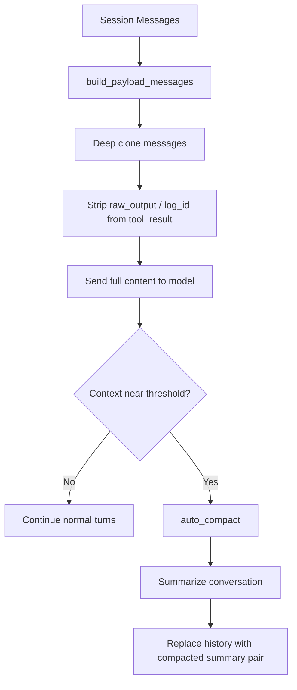

# 12 - 压缩策略

## 当前结论

Somnia 现在只保留一套压缩机制：

1. `payload normalization`
2. `auto compact`

其中真正负责“压缩”的只有 `auto compact`。  
之前的 `payload microcompact` 已经删除。

---

## 总览

---

## 第一层：Payload Normalization

入口：

- `open_somnia/runtime/compact.py`
- `build_payload_messages(messages)`

当前行为只有两件事：

1. 深拷贝消息，避免改写原始会话历史
2. 从 `tool_result` 中移除 `raw_output` 和 `log_id`

说明：

- `content` 不再被裁剪、摘要化或预算压缩
- 历史工具输出会按原样进入模型 payload
- 这样可以避免“工具结果先被压坏，结论还没沉淀”的问题

`raw_output` 和 `log_id` 仍会移除，因为它们是运行时元数据，不属于模型推理必须上下文。

---

## 第二层：Auto Compact

入口：

- `open_somnia/runtime/compact.py`
- `CompactManager.auto_compact(...)`

触发条件：

满足任一条件即触发：

1. 上下文使用率达到 `72%`
2. 或达到 `runtime.token_threshold`

流程：

1. 先把完整会话写入 transcript snapshot
2. 调模型生成 continuation summary
3. 用两条压缩消息替换原始长历史

摘要要求保留这些部分：

- Current goal
- Confirmed decisions
- Open work
- Files changed
- Constraints
- Risks

---

## 为什么删掉了 Payload Microcompact

删除原因很直接：

- 工具结果在常规轮次里被过早压缩
- 压缩后的片段对推理质量伤害太大
- 大量探索问题并不是“上下文太长”，而是“证据在进入下一轮前已经失真”
- 微压缩和探索记忆耦合后，问题更难定位

所以当前策略改成：

- payload 只做最小归一化
- 真正的体积控制留给 `auto compact`

---

## 当前边界

- 极长会话仍可能需要更早进入 `auto compact`
- 由于不再对单轮工具结果做微压缩，某些大输出会更快推高 token 使用量
- 这属于当前刻意接受的权衡，优先保证推理质量

---

## 相关代码

- `open_somnia/runtime/compact.py`
- `open_somnia/runtime/agent.py`
- `tests/test_compact.py`
