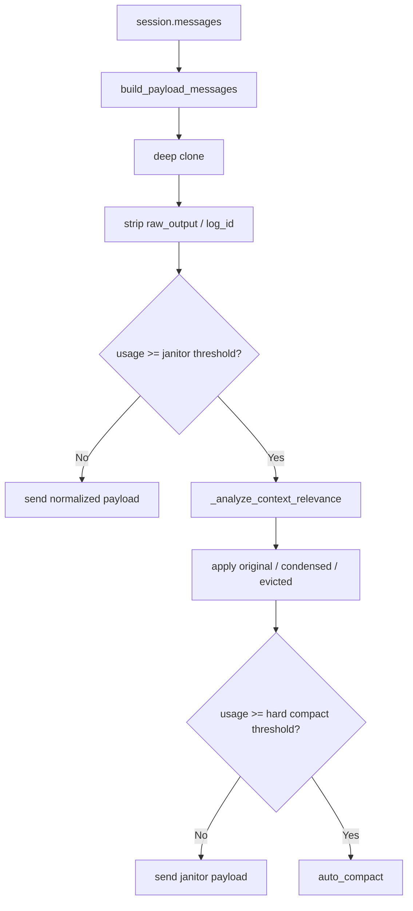

# 14 - 上下文治理优化方案

## 背景

Somnia 当前的上下文治理只有两层：

1. `build_payload_messages()` 只做最小归一化
2. `auto_compact()` 在上下文接近上限时做整段摘要

这套方案稳定，但仍有一个明显问题：

- 在 `auto_compact` 触发之前，历史工具结果会原样持续堆积进 payload
- 一些已经失去价值的目录浏览、重复搜索、一次性确认结果，会持续占用 token
- 现有策略无法区分“长但关键”和“长但已失效”的工具输出

因此需要在“直接保留”和“整体压缩”之间插入一层更聪明的中间层。

---

## 目标

引入一套新的上下文治理机制：

1. 不再依赖静态长度规则直接裁剪历史工具结果
2. 在真正进入 `auto_compact` 之前，先进行 payload-only 的语义脱水
3. 让模型优先保留与当前近期主题强相关的证据
4. 将 `todo` 从主锚点降级为弱锚点，只作为辅助加权
5. 当脱水过度时，允许模型按 `log_id` 恢复原始上下文

---

## 核心结论

新的主判断逻辑应当是：

- `近期主题` 为主锚点
- `工具结果与当前主题的语义相关性` 为核心判断依据
- `时间衰减 + 工具类型` 为结构化辅助信号
- `todo` 只作为弱锚点，不再决定生死

换句话说，新的治理公式不是：

`是否保留 = todo 是否完成`

而是：

`保留优先级 = 近期主题匹配 + 文件/符号命中 + 工具类型权重 + 时间衰减 + todo 弱加权`

---

## 为什么 Todo 只能做弱锚点

`TodoWrite` 对当前任务推进有帮助，但不适合作为上下文治理的主判断器，原因如下：

1. `todo` 粒度通常偏粗，只覆盖当前一小段工作，不覆盖全部推理链
2. 模型并不保证每轮都及时维护 todo，状态可能滞后
3. 很多关键上下文并不直接对应某个 todo 项
4. 即使某个 todo 已完成，相关证据也可能仍对后续步骤有长程价值
5. 没有 todo 的会话也必须具备可用的上下文治理能力

因此，`todo` 更适合做加权项：

- 命中 `in_progress` todo：提高保留概率
- 只服务于 `completed` todo：提高压缩概率
- 没有 todo 命中：不直接判定为无价值

---

## 总体方案

新方案采用“双阶治理”：

### 第一阶：Semantic Janitor

位置：

- `open_somnia/runtime/agent.py`
- `open_somnia/runtime/compact.py`

特点：

- 只影响发送给模型的 payload
- 不改 `session.messages`
- 不改 transcript snapshot
- 不改 resume/session 持久化结构

触发时机：

- 上下文使用率达到预警水位，例如 `50%`

目标：

- 将老旧、弱相关、辅助性的历史工具结果进行“语义脱水”
- 尽量让关键结论保留，低价值原文退出 payload

### 第二阶：Hard Compact

保留现有逻辑：

- 当使用率达到 `72%`
- 或超过 `runtime.token_threshold`

继续使用：

- `CompactManager.auto_compact()`

目标：

- 对更早历史做整体 continuation summary
- 保留最近任务窗口

---

## 工具结果的三种状态

对于进入 janitor 处理范围的历史 `tool_result`，定义三种 payload 状态。

### 1. Original

保持完整内容。

适用场景：

- 当前近期主题强相关
- 当前正在操作的文件、符号、错误信息
- 核心配置内容
- 关键报错栈
- 尚未沉淀为事实结论的调查结果

### 2. Condensed

将原文替换为 1 到 2 句“事实陈述”。

适用场景：

- 结果曾经重要，但当前只需要结论，不再需要全文
- 较早轮次的 `grep` / `glob` / `tree` / `ls`
- 已经在后续对话中被吸收成明确事实的工具输出

建议格式：

`[Semantic Summary | bash | log abc123] Confirmed the project contains open_somnia/runtime and tests directories.`

### 3. Evicted

不保留原文，只保留最小存在性和恢复提示。

适用场景：

- 纯辅助操作
- 重复目录浏览
- 重复搜索
- 一次性环境确认
- 与当前近期主题几乎无关的旧结果

建议格式：

`[Context Evicted | bash | log abc123] Output removed from payload. Use request_original_context if needed.`

---

## 语义治理的主判断信号

### 1. 近期主题

这是主锚点。

来源：

- 最近 2 到 4 轮可见 user/assistant 文本
- 最近一轮尚未完成的任务陈述
- 近期提到的文件路径、模块名、符号名、报错关键词

需要提炼出一个轻量焦点对象，例如：

- 当前目标
- 当前关注文件
- 当前关注符号
- 当前错误或异常关键词

### 2. 工具结果与近期主题的语义相关性

这是核心评分项。

主要看：

- 工具输入里是否命中当前文件路径
- 输出里是否命中当前符号、类名、函数名、错误关键字
- 该结果是否已经被后续 assistant 文本引用或复述

### 3. 时间衰减

越旧的结果，越容易被压缩。

但注意：

- 时间衰减只能降低分数
- 不能单独决定删除
- 老旧但核心的错误栈、配置结论仍应保留

### 4. 工具类型权重

不同工具默认权重不同。

优先保留：

- `read_file`
- `find_symbol`
- `read_file` 风格的源码读取
- 包含错误栈、测试失败、编译错误的 `bash`

优先压缩或驱逐：

- `pwd`
- `cd`
- 重复 `ls`
- 重复 `tree`
- 一次性 `glob`
- 已经被后续明确复述的 `grep`

### 5. Todo 弱加权

只做加分或减分，不做硬判决。

建议规则：

- 命中 `in_progress` todo：`+`
- 命中 `pending` todo：`+/-` 很小
- 只服务于 `completed` todo：`-`
- 无 todo 命中：`0`

---

## 决策机制

采用“LLM 审计优先，确定性规则兜底”的方式。

### 1. LLM 审计

当上下文达到预警水位时，进行一次内部审计调用。

这个调用不面向用户，不写入会话历史，只返回决策表。

输入内容包括：

- 当前近期主题摘要
- 当前可见 todo 摘要
- 候选历史工具结果的简要卡片

每条候选卡片至少包含：

- `message_index`
- `item_index`
- `tool_name`
- `tool_input_preview`
- `output_preview`
- `output_length`
- `log_id`
- `age`

模型输出 JSON，例如：

```json
[
  {
    "message_index": 12,
    "item_index": 0,
    "state": "condensed",
    "summary": "Confirmed connection string is defined in main.py near line 12."
  },
  {
    "message_index": 18,
    "item_index": 0,
    "state": "evicted"
  }
]
```

### 2. 规则兜底

以下情况直接走本地规则：

- provider 调用失败
- 输出 JSON 不合法
- 审计返回不完整

回退规则建议：

1. 最近 1 到 2 轮工具结果默认不处理
2. 包含错误栈、测试失败、异常文本的结果优先保留
3. `read_file` 默认比 `grep/tree/ls` 更保守
4. 老旧且弱相关的 `pwd/cd/ls/tree` 优先 `evicted`
5. 老旧且中等相关的 `grep/glob` 优先 `condensed`

---

## 建议的触发阈值

建议保留两套阈值：

### 1. Janitor 预警阈值

- 建议：`50%`

作用：

- 提前做轻量治理
- 减少上下文无意义膨胀
- 尽量延后 `auto_compact`

### 2. Hard Compact 阈值

沿用当前规则：

- `72%`
- 或 `runtime.token_threshold`

作用：

- 作为真正的兜底压缩机制

---

## 处理范围

Semantic Janitor 不应处理全部消息，只处理候选的历史工具结果。

建议范围：

1. 不处理最近 1 到 2 轮 tool result
2. 不处理当前轮刚产生的工具输出
3. 不处理 assistant 文字消息
4. 不处理用户原始任务描述
5. 不处理系统提示和工具 schema

这能降低误伤，避免模型刚读到的证据马上被脱水。

---

## Payload 构建流程

新的 payload 构建建议改为：



关键点：

- `janitor` 是 payload-only
- `auto_compact` 仍然是 session-level 替换

---

## 运行时实现建议

### A. `open_somnia/runtime/compact.py`

建议新增：

1. `ToolResultLocator`
用于稳定定位某个 `tool_result` 在 payload 中的位置

2. `SemanticCompressionDecision`
字段建议：

- `message_index`
- `item_index`
- `state`
- `summary`

3. `apply_semantic_compression(payload_messages, decisions)`
根据决策将指定 `tool_result` 替换成 `original/condensed/evicted`

4. 候选提取函数
从 payload 中提取历史工具结果卡片，供 janitor 分析使用

### B. `open_somnia/runtime/agent.py`

建议新增私有方法：

1. `_should_run_context_janitor(usage)`
判断是否进入 janitor 预警区

2. `_extract_recent_topic_context(session)`
从近期可见对话中抽取主题焦点

3. `_build_tool_result_candidates(messages)`
为候选工具结果生成轻量卡片

4. `_analyze_context_relevance(session, messages, system_prompt, tools)`
执行 LLM 审计或规则兜底

5. `_messages_for_model(messages, session=None, actor="lead", role="lead coding agent")`
将当前的 payload 构建入口升级为：

- 先做基础 normalize
- 达到预警阈值时再做 janitor
- 返回最终用于计 token 和推理的 payload

### C. 新工具：`request_original_context`

建议注册在 runtime 本地工具中。

输入：

```json
{
  "log_id": "abc123"
}
```

输出：

- 从 `.open_somnia/logs/tool_logs/<log_id>.json` 读取原始输出
- 以可直接进入模型上下文的文本返回

建议格式：

```text
[Restored tool output | bash | log abc123]
<full output here>
```

---

## Janitor Prompt 设计

内部提示词应极短，只做决策，不做解释性写作。

建议系统提示：

```text
You are a context janitor for a coding agent.
Decide which old tool results should stay original, be condensed into one factual sentence, or be evicted.
Prioritize the current recent topic. Todo items are only weak hints.
Return strict JSON only.
```

建议用户输入结构：

```text
Current recent topic:
- Fix connection error in main.py
- Active files: main.py, config.py
- Active symbols: connect_db
- Error keywords: connection string, timeout

Todo hints:
- in_progress: verify database settings
- completed: inspect workspace layout

Candidate tool results:
1. tool=bash log=abc123 age=8
   input=ls -R
   output_preview=...
   output_length=2048

2. tool=grep log=def456 age=6
   input=grep "connection"
   output_preview=...
   output_length=980

Return JSON list with:
- message_index
- item_index
- state
- summary(optional when state=condensed)
```

---

## 输出格式约束

为了降低兼容风险，建议 janitor 只改写 `tool_result.content`，不改消息结构。

也就是说：

- `tool_call_id` 保留
- `content` 替换为 summary 或 evicted note
- `raw_output` 和 `log_id` 依旧不进入 payload

这样可以保证：

- OpenAI / Anthropic provider 适配层无需大改
- 工具结果消息仍符合当前消息协议

---

## 对 Token 统计的要求

`context_window_usage()` 必须使用和真正推理一致的 payload。

否则会出现两个问题：

1. 估算 token 时看的是未治理 payload，导致 janitor 实际收益不可见
2. 触发阈值判断与真实发送内容不一致，行为会抖动

因此必须统一：

- `context_window_usage()`
- `complete(...)` 前实际使用的 `payload_messages`

都走同一套 `_messages_for_model(...)`

---

## 恢复原始上下文的原则

一旦引入 `condensed` / `evicted`，就必须配套恢复机制。

设计原则：

1. 恢复应按 `log_id` 精确定位
2. 恢复来源应直接来自工具日志，不依赖 session 中是否还保留原文
3. 恢复动作应显式发生，不应自动偷偷回填
4. 恢复后内容只影响当前后续推理，不需要改写历史 session

这与当前 `ToolLogStore` 的设计是兼容的。

---

## 与现有持久化模型的关系

第一阶段不建议修改以下内容：

1. `AgentSession` 存储结构
2. `.open_somnia/sessions`
3. `.open_somnia/transcripts`
4. resume 过滤逻辑
5. REPL 渲染逻辑

原因：

- 这次优化的收益主要在运行时 payload 层
- 如果一开始就改持久化结构，会放大回归范围
- 当前仓库已经有 `tool_logs` 可作为恢复来源，不需要额外改存储

---

## 测试计划

### 1. `tests/test_compact.py`

新增或调整：

1. `build_payload_messages()` 在 janitor 前后都不改写原始历史
2. `condensed` 状态会替换 content 为摘要文本
3. `evicted` 状态只保留恢复提示
4. 最近窗口内的工具结果不会被处理
5. metadata stripping 依旧成立

### 2. `tests/test_runtime_tool_output.py`

新增或调整：

1. `context_window_usage()` 使用 janitor 后 payload 计 token
2. `_agent_loop()` 在预警区执行 janitor，但不改 session 历史
3. 超过 hard compact 阈值时仍进入 `auto_compact`
4. `request_original_context` 能按 `log_id` 恢复完整输出

### 3. 重点回归

建议至少执行：

```bash
python -m unittest tests.test_cli_resume tests.test_process_output tests.test_repl_todo tests.test_runtime_tool_output tests.test_compact
```

---

## 建议的第一阶段落地范围

建议本次只做最小可用版本。

### 要做

1. `近期主题主锚点 + todo 弱锚点`
2. payload-only semantic janitor
3. `original / condensed / evicted` 三态
4. `request_original_context`
5. 统一 token 估算与真实 payload
6. 第一阶段直接使用当前活跃主模型执行 janitor 审计
7. 单元测试与回归测试

### 暂不做

1. 后台异步增量脱水
2. 长期持久化的脱水状态
3. 原始上下文恢复后的自动再压缩
4. 独立的小模型路由器
5. 复杂的 todo 与工具结果显式关联图

---

## 风险与应对

### 风险 1：审计本身增加 token 成本

应对：

- 第一阶段直接复用当前活跃主模型，不额外引入多模型机制
- 只在 `50%` 预警区触发
- 只分析较老的候选工具结果
- 候选卡片只传 preview，不传全文

### 风险 2：LLM 过度压缩关键证据

应对：

- 最近 1 到 2 轮不处理
- 高价值工具默认保守
- 提供 `request_original_context`

### 风险 3：近期主题抽取不准

应对：

- 增加规则兜底
- 以文件路径、符号名、错误关键词做硬信号增强

### 风险 4：行为不可预测

应对：

- 限定输出协议为严格 JSON
- 审计失败立即回退本地规则
- 第一版不改持久化

---

## 最终建议

Somnia 的上下文治理应从“静态裁剪”升级为“近期主题驱动的语义治理”。

明确建议如下：

1. `近期主题` 做主锚点
2. `todo` 只做弱锚点
3. 在 `auto_compact` 之前增加 payload-only 的 `Semantic Janitor`
4. 对历史工具结果引入 `original / condensed / evicted` 三态
5. 为被脱水内容提供 `request_original_context(log_id)` 恢复能力
6. 第一阶段只改 runtime payload 层，不动 session 持久化结构

这条路线的优点是：

- 能减少上下文浪费
- 能保留真正的长程依赖
- 兼容现有 REPL 和 session 模型
- 回归范围可控

它比“按 todo 完成状态直接裁剪”更稳，也更符合 Somnia 的实际交互模式。
