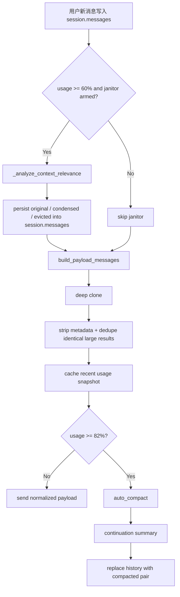
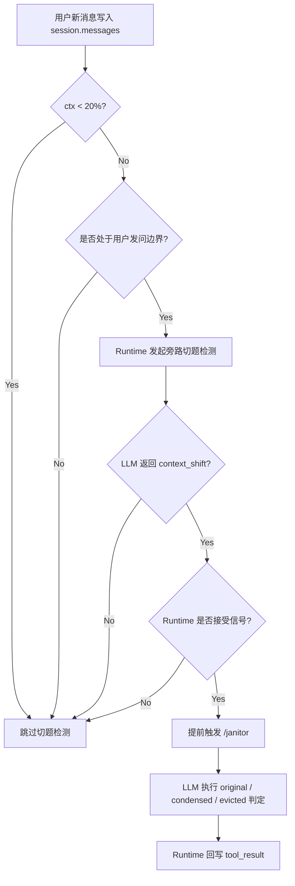

# 上下文治理与压缩

## 概述

Somnia 的上下文治理与压缩体系负责在对话过程中智能管理上下文体积，确保推理质量的同时避免上下文窗口溢出。体系由三层组成：

1. **Payload Normalization** — 基础归一化
2. **Semantic Janitor** — 语义脱水（默认 60% 自动触发阈值，可通过 `runtime.janitor_trigger_ratio` 配置，带会话级低收益熔断）
3. **Auto Compact** — 整体摘要压缩（82% 自动触发阈值）

在这三层现有机制之上，当前又增加了一层**旁路 Topic Shift Assist**：

- 不直接改写主对话
- 只在必要时由 runtime 单独发起轻量切题判断
- 让 janitor 能在明显话题切换时更早介入

---

## 总览

### 当前实现



### 当前实现补强：Topic Shift Assist



---

## 第一层：Payload Normalization

入口：`open_somnia/runtime/compact.py`

```python
def build_payload_messages(messages, semantic_decisions=None):
    payload_messages = _clone_messages_for_payload(messages)
    apply_semantic_compression(payload_messages, semantic_decisions)
    # strip raw_output/log_id from all tool_results in the payload copy
    # collapse older identical large tool_results into a short placeholder
    return payload_messages
```

职责有三件事：

1. **深拷贝消息**，避免改写原始会话历史
2. **从 payload 副本里的 `tool_result` 中移除 `raw_output` / `log_id`**，避免把运行时冗余直接塞进模型上下文
3. **对较大的完全重复工具结果做确定性去重**，保留最新完整副本，把更早的相同副本替换成简短占位

这里的去重不是 Semantic Janitor，也不是语义摘要。它只做无语义判断的“同内容折叠”，当前键主要基于：

- `tool_name`
- 归一化后的 `tool_input`（忽略 `importance`）
- `content` 哈希

因此：

- `session.messages` 不会因为 payload 去重而被改写
- `request_original_context(log_id)` 的恢复能力仍依赖会话历史和 tool log，而不是 payload 副本
- `content` 不再被预先微压缩，但完全重复的大结果也不会无限次原样进入模型 payload

---

## 第二层：Semantic Janitor（语义治理）

阈值：默认读取 `runtime.janitor_trigger_ratio = 0.6`（上下文使用率 60%）

配置示例：

```toml
[runtime]
janitor_trigger_ratio = 0.6
```

### 核心机制

当用户新消息已经写入 `session.messages` 之后，如果当前上下文使用率达到自动触发水位，会在**进入 Agent Loop 前**对历史工具结果执行语义脱水：

- **直接回写 `session.messages`**
- **保留 `log_id`，移除 `raw_output`**
- **不改 transcript snapshot 的历史来源**
- 保护最近 2 轮工具结果不被处理

这一步的目标不只是让本轮 payload 变小，而是让后续每一轮的工作内存都真正瘦身，避免 `session.messages` 长期不变导致的反复深拷贝、反复计数、反复 I/O。

现在自动 janitor 不再作为 `_messages_for_model()` 或 `context_window_usage()` 的副作用执行。  
这意味着：

- Agent 在一个持续中的工具链/思考链里不会因为中途计数而被插入 janitor
- 本次用户发问天然会进入“近期主题”窗口，作为 janitor 的最新锚点
- payload 构建和 ctx 计数重新变回无副作用读操作

### 当前补强：Topic Shift Assist

当前实现里，自动 janitor 的主要触发仍然由 runtime 在 `>= 60%` 的 ctx 水位上决定。  
当前已补入一个更早的旁路触发信号：

- **`ctx < 20%`**：不做话题切换检测，节省 token
- **`20% <= ctx < 60%`**：只在**用户发问边界**允许 runtime 发起轻量切题检测
- **`ctx >= 60%`**：仍以自动 janitor 规则为主，切题信号只作为额外加权依据

这里的切题检测是一次**旁路治理调用**，不是正式会话消息：

- 不写入 `session.messages`
- 不写入 transcript
- 不生成新的 assistant / user 正式消息
- 只返回治理信号，如 `context_shift: true/false`

因此它不会污染主上下文，只影响 runtime 是否提前触发 `/janitor`。

### Runtime 与 LLM 的分工

在完整方案里，两者的职责是分层的：

1. **LLM 判断是否明显话题切换**
2. **Runtime 决定是否真的触发 `/janitor`**
3. **LLM 对 janitor 候选做 `original / condensed / evicted` 判定**
4. **Runtime 把结果真正写回历史工具消息**

换句话说：

- LLM 提供语义信号
- Runtime 负责触发条件、熔断、回写和一致性

### 工具结果的三种状态

| 状态 | 行为 | 适用场景 |
|------|------|----------|
| `original` | 保持完整 | 强相关、当前操作文件、关键报错栈 |
| `condensed` | 替换为 1-2 句事实陈述 | 早期搜索结果、已被吸收的结论 |
| `evicted` | 仅保留恢复提示 | 重复目录浏览、一次性确认 |

### 当前方案与旧方案的差异

旧方案是“`50%` 预警触发 + `45%` 回滞重置 + `60%` 强制重跑 + 连续两次低于 `5%` 才熔断”。  
当前方案收敛为更直接的一套规则：

- **自动 janitor 触发点**：`>= 60%`
- **手动 `/janitor` 阈值**：`>= 20%`
- **会话级低收益熔断**：只看最近一次**自动 janitor**

这样调整后的含义是：

- `50% ~ 60%` 区间不再做自动 janitor，优先保留工作上下文，减少过早脱水
- 自动 janitor 的启动条件从“预警式提前介入”改成“到 60% 再介入”
- 自动 janitor 的执行时机从“Agent Loop / payload 构建中途触发”改成“用户发问边界触发”
- 熔断从“连续两次都很差才停”改成“上次自动 janitor 已经证明收益很低，就直接停掉本会话后续自动 janitor”
- 用户显式执行 `/janitor` 时，不受自动熔断影响；只要当前占用达到 `20%`，仍可手动执行

这层补强不会改变底层 janitor 规则，只是在 `20% ~ 60%` 区间内增加“明显话题切换时可提前清理”的旁路入口。

### 跳过条件

即使达到自动 janitor 阈值，也不会盲目反复进入语义审计。当前还会在进入重型审计前做几层快速跳过：

- **增量不足跳过**：距离上次 janitor 只增加了很少的 token 和很小的占用比例时，直接跳过
- **候选耗尽跳过**：如果历史里已经没有可修剪的长工具结果，跳过并视为当前会话已接近饱和
- **低收益熔断**：如果上一次自动 janitor 的脱水比例低于 `10%`，则本次会话后续不再自动触发 janitor
- **接近 auto compact 跳过**：如果上下文已经逼近 auto compact 区间，直接放弃 janitor 的精细操作

这个熔断只作用于**自动 janitor**。手动 `/janitor` 不计入自动熔断判断，也不受自动熔断影响。

### 脱水比例定义

为避免口径歧义，这里的“脱水比例”按一次自动 janitor 前后的 payload token 变化计算：

```text
dehydration_ratio = (before_tokens - after_tokens) / before_tokens
```

约束：

- `before_tokens`、`after_tokens` 都指同一轮 janitor 前后、同一套 payload 构建口径下的 token 估算值
- 只有 `after_tokens <= before_tokens` 时，脱水比例才视为正收益
- 若上一次自动 janitor 的 `dehydration_ratio < 10%`，则后续自动 janitor 直接熔断
- 该判断不回看手动 `/janitor`

### 判断信号

#### 当前实现的主锚点

- 最近 2-4 轮 user/assistant 文本
- 当前目标、关注文件、关注符号、错误关键词

#### 切题判断输入

“是否切题”的判断对象不是简单的“最近 1 到 2 轮摘要”，而是：

```text
最新用户消息
vs
当前主题快照
```

其中：

- **当前主题快照**是主锚点
- **近期对话摘录**只是辅助信号

推荐旁路输入结构：

```json
{
  "topic_snapshot": {
    "active_files": ["context_service.py", "test_context_service.py"],
    "active_symbols": ["_append_message_sync", "_read_messages_file_locked_sync"],
    "keywords": ["context_service", "meta", "incremental", "git"],
    "todo_in_progress": ["更新 test_context_service.py 适配新方法"]
  },
  "recent_dialogue_excerpt": [
    "assistant: test_context_service.py 还在引用已删除的方法",
    "user: 提交git",
    "assistant: test_context_service.py 没有变更。只提交 context_service.py"
  ],
  "latest_user_message": "现在看另一个脚本"
}
```

约束：

- `latest_user_message` 必须始终携带
- `topic_snapshot` 是主判断依据
- `recent_dialogue_excerpt` 只补充过渡语气，不单独决定是否切题
- `ctx < 20%` 时，这次旁路判断根本不发起

**核心评分：语义相关性**
- 工具输入/输出是否命中当前文件路径
- 是否命中当前符号、类名、函数名
- 结果是否已被后续 assistant 文本引用

**辅助信号：**
- 时间衰减（越旧越低分，但不能单独决定删除）
- 工具类型权重（`read_file`/`find_symbol` 优先保留；`pwd`/`cd`/`tree` 优先压缩）
- **Todo 仅做弱锚点**：命中 `in_progress` 加分，仅服务于 `completed` 减分
- **`importance`**：作为额外权重接入 janitor 排序与“是否值得提前触发 `/janitor`”的判断

### 决策机制

采用"LLM 审计优先，确定性规则兜底"：

```python
def _analyze_context_relevance(self, session, messages, system_prompt, tools):
    candidates = extract_tool_result_candidates(messages, preserve_recent_rounds=2)
    selected = sorted(candidates, key=lambda item: (item.output_length, item.age), reverse=True)[:12]
    topic_context = self._extract_recent_topic_context(messages)
    fallback = self._fallback_context_relevance_decisions(session, selected, topic_context)

    try:
        turn = self.provider.complete(system_prompt=JANITOR_SYSTEM_PROMPT, ...)
        parsed = self._parse_semantic_janitor_response(text, selected)
        return parsed or fallback
    except Exception:
        return fallback
```

### 规则兜底逻辑

```text
score = 0
- 包含错误: +5
- 命中当前文件: +3
- 命中当前符号: +2/个
- 命中主题关键词: +1/个
- 命中 in_progress todo: +1/个
- read_file/find_symbol 类型: +2
- pwd/cd/ls/tree/glob 类型: -3
- 年龄 >= 6 轮: -1
- 年龄 >= 10 轮: -1

score >= 5  -> original
score >= 2  -> condensed
otherwise   -> evicted (低价值工具) 或 condensed (其他)
```

### `importance`

当前实现已经把 `importance` 作为 janitor 的额外权重输入，但不是唯一依据。  
建议保留三档：

- `glance`
- `investigate`
- `foundation`

用途：

- `glance`：扫一眼即可丢弃的低价值结果
- `investigate`：普通检索/探索结果
- `foundation`：关键文件、关键报错、关键结论，优先保留

`importance` 当前参与两层判断：

1. **janitor 脱水排序**
2. **Runtime 接收到切题信号后，是否值得提前触发 `/janitor` 的综合评估**

但它始终要与以下因素共同作用：

- recency
- task status
- output size
- active files / symbols 命中情况
- error / success 语义

### 持久化后的表现

当某条 `tool_result` 被 janitor 处理后：

- `semantic_state` 会写回消息项
- `content` 会替换成语义摘要或驱逐提示
- `raw_output` 会被移除
- `log_id` 保留

后续再次抽取 janitor 候选时，会**跳过已经是 `condensed` / `evicted` 的结果**，避免重复审计同一份旧证据。

### 旁路检测日志

在开启 `SOMNIA_DEBUG_PROVIDER_PAYLOADS=1` 时，除了普通 `turn` 和 `janitor` 调用之外，旁路切题检测也会单独落盘：

- `kind = "topic_shift"`
- `provider_request`
- `provider_response`
- `response_text`
- `provider_error`
- `latency_ms`

---

## 第三层：Auto Compact（整体压缩）

阈值：`AUTO_COMPACT_TRIGGER_RATIO = 0.82`（上下文使用率 82%）

入口：`open_somnia/runtime/compact.py` -> `CompactManager.auto_compact(...)`

### 流程

1. 先把完整会话写入 **transcript snapshot**
2. 调模型生成 **continuation summary**
3. 用两条压缩消息替换原始长历史
4. 重新计算一次 recent context snapshot，避免 UI 继续显示旧的高占用

### 摘要必须保留的内容

- Current goal
- Confirmed decisions
- Open work
- Files changed
- Constraints
- Risks

### 系统提示

```text
Compress the conversation for continuity.
Return concise plain text with these exact sections:
Current goal
Confirmed decisions
Open work
Files changed
Constraints
Risks
Focus on concrete state the next turn needs.
```

### 压缩后格式

```text
[Compressed. Full transcript saved for session {session_id}]
{continuation summary}

Understood. Continuing from compacted context.
```

---

## 恢复原始上下文

工具：`request_original_context(log_id)`

当 janitor 将工具结果压缩或驱逐后，Agent 可通过 `log_id` 恢复完整原始输出：

```text
[Restored tool output | bash | log abc123]
<full output here>
```

恢复来源：`.open_somnia/logs/tool_logs/{log_id}.json`

### 恢复原则

1. 按 `log_id` 精确定位
2. 来源直接来自 `.open_somnia/logs/tool_logs/*.json`，不依赖 `session.messages` 中是否保留原文
3. 恢复动作显式发生，不自动回填
4. 恢复后内容只影响当前后续推理，不改写历史 session

---

## UI 与性能修复

之前一个关键卡顿来源是：REPL 底部状态栏显示 `ctx: xx%` 时，会反复调用 `runtime.context_window_usage()`；而这个函数如果带副作用，就可能触发：

- payload 构建
- token 计数
- janitor 判定

这会直接导致：

- 输入框打字发卡
- 工具执行时底部常驻栏长时间消失
- `interrupt` 响应慢
- `somnia -c` 恢复也变慢

现在改为：

- 真实计算发生在正常 agent 流程里
- 自动 janitor 只在用户发问边界执行，不在 `context_window_usage()` 内触发
- 运行时把结果写入 `recent_context_window_usage`
- REPL 状态栏只读取这个**最近快照**

因此状态栏重绘不再进入完整上下文计算链路。

---

## 手动命令

- `/janitor`：手动执行语义清洁工
- `compress`：执行整体 compact

区别：

- `janitor` 只处理历史工具结果，尽量保留原会话结构
- `compact` 会把长历史折叠成 continuation summary

---

## 为什么删除了 Payload Microcompact

之前的微压缩机制已删除，原因：

- 工具结果在常规轮次里被过早压缩
- 压缩后的片段对推理质量伤害太大
- 大量问题不是"上下文太长"，而是"证据在进入下一轮前已经失真"
- 微压缩和探索记忆耦合后，问题更难定位

当前策略：payload 只做最小归一化，真正的体积控制交给 Semantic Janitor + Auto Compact。

---

## 当前边界

- 极长会话仍可能在 `60%` 之后很快逼近 `auto compact`
- 由于不对单轮工具结果做微压缩，某些大输出会更快推高 token 使用量
- Janitor 冷却避免了重复跑，但首次语义审计本身仍然有成本
- 这是刻意接受的权衡，优先保证推理质量和后续稳定性

---

## 相关代码

- `open_somnia/runtime/compact.py` — `CompactManager`, `build_payload_messages`, `extract_tool_result_candidates`, `persist_semantic_compression`
- `open_somnia/runtime/agent.py` — `_run_automatic_context_janitor`, `_messages_for_model`, `_should_run_context_janitor`, `recent_context_window_usage`, `_analyze_context_relevance`, `request_original_context`, `run_semantic_janitor`
- `open_somnia/cli/repl.py` — 底部状态栏读取 recent context snapshot
- `open_somnia/storage/tool_logs.py` — `ToolLogStore`
- `tests/test_compact.py` — 单元测试
