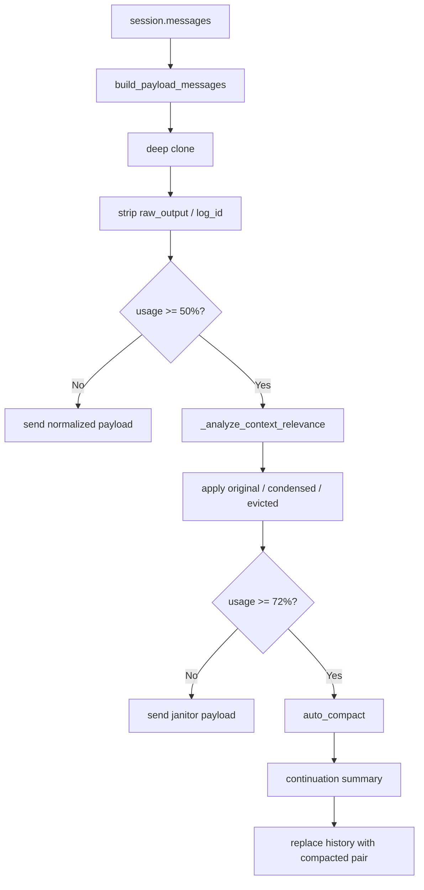

# 上下文治理与压缩

## 概述

Somnia 的上下文治理与压缩体系负责在对话过程中智能管理上下文体积，确保推理质量的同时避免上下文窗口溢出。体系由三层组成：

1. **Payload Normalization** — 基础归一化
2. **Semantic Janitor** — 语义脱水（50% 预警阈值）
3. **Auto Compact** — 整体摘要压缩（72% 兜底阈值）

---

## 总览



---

## 第一层：Payload Normalization

入口：`open_somnia/runtime/compact.py`

```python
def build_payload_messages(messages, semantic_decisions=None):
    payload_messages = _clone_messages_for_payload(messages)
    apply_semantic_compression(payload_messages, semantic_decisions)
    # strip raw_output / log_id from all tool_results
    return payload_messages
```

职责只有两件事：

1. **深拷贝消息**，避免改写原始会话历史
2. **从 `tool_result` 中移除 `raw_output` 和 `log_id`**（运行时元数据）

`content` 不再被裁剪或摘要化。历史工具输出按原样进入模型 payload，避免"工具结果先被压坏，结论还没沉淀"的问题。

---

## 第二层：Semantic Janitor（语义治理）

阈值：`SEMANTIC_JANITOR_TRIGGER_RATIO = 0.50`（上下文使用率 50%）

### 核心机制

当上下文使用率达到预警水位时，在 payload 构建阶段对历史工具结果执行语义脱水：

- **只影响发送给模型的 payload**，不改 `session.messages`
- **不改 transcript snapshot**，不改持久化结构
- 保护最近 2 轮工具结果不被处理

### 工具结果的三种状态

| 状态 | 行为 | 适用场景 |
|------|------|----------|
| `original` | 保持完整 | 强相关、当前操作文件、关键报错栈 |
| `condensed` | 替换为 1-2 句事实陈述 | 早期搜索结果、已被吸收的结论 |
| `evicted` | 仅保留恢复提示 | 重复目录浏览、一次性确认 |

### 判断信号

**主锚点：近期主题**
- 最近 2-4 轮 user/assistant 文本
- 当前目标、关注文件、关注符号、错误关键词

**核心评分：语义相关性**
- 工具输入/输出是否命中当前文件路径
- 是否命中当前符号、类名、函数名
- 结果是否已被后续 assistant 文本引用

**辅助信号：**
- 时间衰减（越旧越低分，但不能单独决定删除）
- 工具类型权重（`read_file`/`find_symbol` 优先保留；`pwd`/`cd`/`tree` 优先压缩）
- **Todo 仅做弱锚点**：命中 `in_progress` 加分，仅服务于 `completed` 减分

### 决策机制

采用"LLM 审计优先，确定性规则兜底"：

```python
def _analyze_context_relevance(self, session, messages, system_prompt, tools):
    # 1. 提取候选工具结果（保护最近 2 轮，选最多 12 条）
    candidates = extract_tool_result_candidates(messages, preserve_recent_rounds=2)
    selected = sorted(candidates, key=lambda item: (item.output_length, item.age), reverse=True)[:12]
    
    # 2. 抽取近期主题上下文
    topic_context = self._extract_recent_topic_context(messages)
    todo_context = self._todo_hint_context(session)
    
    # 3. 准备规则兜底
    fallback = self._fallback_context_relevance_decisions(session, selected, topic_context)
    
    # 4. LLM 审计（失败时回退到规则）
    try:
        turn = self.provider.complete(system_prompt=JANITOR_SYSTEM_PROMPT, ...)
        parsed = self._parse_semantic_janitor_response(text, selected)
        return parsed or fallback
    except Exception:
        return fallback
```

### 规则兜底逻辑

```
score = 0
- 包含错误: +5
- 命中当前文件: +3
- 命中当前符号: +2/个
- 命中主题关键词: +1/个
- 命中 in_progress todo: +1/个
- read_file/find_symbol 类型: +2
- pwd/cd/ls/tree/glob 类型: -3
- 年龄 >= 6 轮: -1
- 年龄 >= 10 轮: -1

score >= 5  → original
score >= 2  → condensed
否则        → evicted (低价值工具) 或 condensed (其他)
```

---

## 第三层：Auto Compact（整体压缩）

阈值：`AUTO_COMPACT_TRIGGER_RATIO = 0.72`（上下文使用率 72%）或 `runtime.token_threshold`

入口：`open_somnia/runtime/compact.py` → `CompactManager.auto_compact(...)`

### 流程

1. 先把完整会话写入 **transcript snapshot**
2. 调模型生成 **continuation summary**
3. 用两条压缩消息替换原始长历史

### 摘要必须保留的内容

- Current goal
- Confirmed decisions
- Open work
- Files changed
- Constraints
- Risks

### 系统提示

```text
Compress the conversation for continuity.
Return concise plain text with these exact sections:
Current goal
Confirmed decisions
Open work
Files changed
Constraints
Risks
Focus on concrete state the next turn needs.
```

### 压缩后格式

```
[Compressed. Full transcript saved for session {session_id}]
{continuation summary}

Understood. Continuing from compacted context.
```

---

## 恢复原始上下文

工具：`request_original_context(log_id)`

当 janitor 将工具结果压缩或驱逐后，Agent 可通过 `log_id` 恢复完整原始输出：

```
[Restored tool output | bash | log abc123]
<full output here>
```

恢复来源：`.open_somnia/logs/tool_logs/{log_id}.json`

### 恢复原则

1. 按 `log_id` 精确定位
2. 来源直接来自工具日志，不依赖 session 中是否保留原文
3. 恢复动作显式发生，不自动回填
4. 恢复后内容只影响当前后续推理，不改写历史 session

---

## 为什么删除了 Payload Microcompact

之前的微压缩机制已删除，原因：

- 工具结果在常规轮次里被过早压缩
- 压缩后的片段对推理质量伤害太大
- 大量问题不是"上下文太长"，而是"证据在进入下一轮前已经失真"
- 微压缩和探索记忆耦合后，问题更难定位

当前策略：payload 只做最小归一化，真正的体积控制交给 Semantic Janitor + Auto Compact。

---

## 当前边界

- 极长会话仍可能需要更早进入 `auto compact`
- 由于不对单轮工具结果做微压缩，某些大输出会更快推高 token 使用量
- 这是刻意接受的权衡，优先保证推理质量

---

## 相关代码

- `open_somnia/runtime/compact.py` — `CompactManager`, `build_payload_messages`, `extract_tool_result_candidates`, `apply_semantic_compression`
- `open_somnia/runtime/agent.py` — `_messages_for_model`, `_analyze_context_relevance`, `_fallback_context_relevance_decisions`, `request_original_context`
- `open_somnia/storage/tool_logs.py` — `ToolLogStore`
- `tests/test_compact.py` — 单元测试
