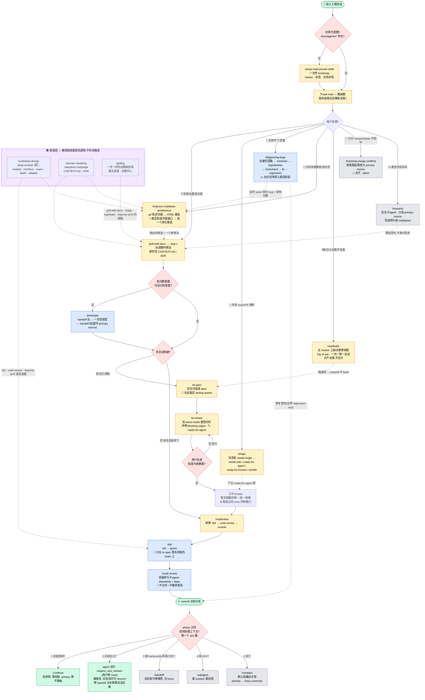

# Matt Pocock's Engineering Skills — Flow Map

A corrected map of how the skills in `skills-main/skills/engineering/` compose into
workflows. Source of truth for the composition is each skill's `SKILL.md` (especially
`ask-matt/SKILL.md`, which is the router). This doc exists to orient before porting or
adapting any of them.

## Legend

| Color | Meaning |
|-------|---------|
| 🟢 green | start / end |
| 🟡 yellow | user-invoked skill (`disable-model-invocation: true`) |
| 🔵 blue | model-invoked skill (rich triggers, the model reaches for it) |
| 🔴 red | decision gate |
| 🟣 purple | primitive / vocabulary layer — loaded by name, never manually triggered |
| ⚪ gray | standalone, off every flow |

## Flow

## Notes

- **Phase boundary (context management)** is shown once, anchored at `commit`, but the
  decision recurs at **every** phase seam (grill → implement, implement → QA, …). It is
  an ordered tree — the first `yes` wins — not five parallel options. Mermaid can't
  render "ordered", so the edge numbers encode the priority.
- **`/handoff` vs `/compact` are both lossy** — both turn the primary source (the session
  as it happened) into a secondary summary. The real distinction is *portability*
  (handoff: new harness / dir / colleague / side-task) vs *same-line continuation*
  (compact). `Continue` is ruled out first because it is the only zero-cost move.
- **Omitted** standalone helpers that sit on no flow path: `/grill-me`, `/to-questionnaire`,
  `/wait-what`, `/wizard`, `/teach`, `/writing-for-agents`.
- `ask-matt`'s own "Vocabulary underneath" lists only `domain-modeling` + `codebase-design`;
  `/grilling` is classified there as a standalone *primitive*. It is grouped into the
  primitive layer here because, like the other two, it is loaded by name rather than
  manually triggered.
