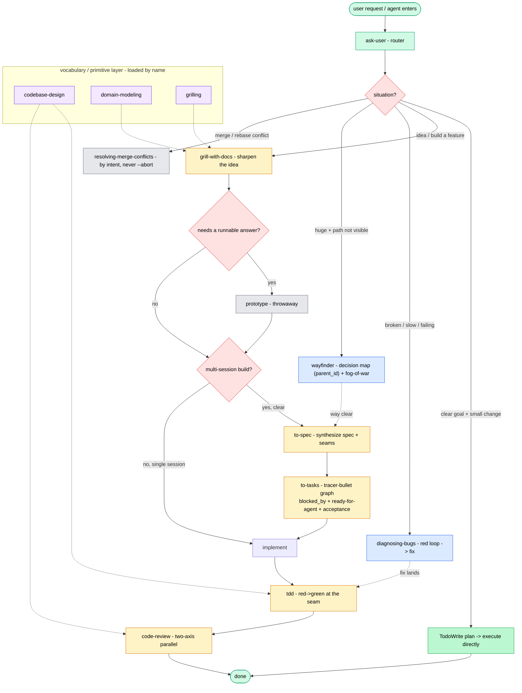

# Ask User

You don't remember every skill, so ask. A **flow** is a path through the skills.
Most paths run along one **main flow**; a few **on-ramps** merge onto it.

## Trivial path — clear goal, small change

If the user's goal is unambiguous **and** the change is small (a single focused
edit, a one-off fix, a tiny addition), **don't reach for the skill machinery**.
Lay out a short plan with `TodoWrite`, execute it directly, done. Everything
below is for work that is bigger, fuzzier, or genuinely benefits from a spec /
tests / review. When in doubt, prefer this path — the flows exist to add
discipline, not ceremony, to small clear tasks.

## The map

## The main flow: idea → ship

The route most work travels.

1. **`/+grill-with-docs`** — sharpen the idea by interview. Start here whenever
   you're in a working directory (it leaves a paper trail in `CONTEXT.md`/ADRs).
2. **Branch — does a question need a runnable answer?** (state, business logic, a
   UI you have to see) → detour through **`/+prototype`**, then bring the answer
   back.
3. **Branch — is this a multi-session build?**
   - **Yes** → **`/+to-spec`** (synthesize the conversation into a spec + decide
     the testing seams), then **`/+to-tasks`** (break it into tracer-bullet tasks
     with blocking edges, stamped ready-for-agent). Work the frontier:
     **`/+implement`** one task per fresh context window, `/clear` between.
   - **No** → **`/+implement`** right here in this context.

   Either way, **`implement`** builds each task by driving **`/+tdd`** at the
   pre-agreed seams, then closes out with **`/+code-review`** before committing
   and calling `task_close`.

## On-ramps

- **Something's broken / slow / throwing / failing** → **`/+diagnosing-bugs`**.
- **A huge, foggy effort — too big for one session and the path isn't visible** →
  **`/+wayfinder`** (chart a map of decision tasks; slower and denser, so save it
  for exactly this, never a well-scoped feature).

## Standalone

- **`/+prototype`** — a throwaway to answer one design question.
- **`/+resolving-merge-conflicts`** — mid-merge or mid-rebase, hunk by hunk.

## Vocabulary underneath (loaded by name, not by hand)

- **`/+codebase-design`** — the deep-module vocabulary (module / interface /
  seam / depth / adapter).
- **`/+domain-modeling`** — ubiquitous language, `CONTEXT.md`, ADRs.
- **`/+grilling`** — the one-question-at-a-time interview primitive.

Reach for these directly only when the *words*, not the process, are the problem;
otherwise let the skills above pull them in.

## Context hygiene

Keep the grilling → spec → tasks steps in **one unbroken context window** (don't
compact or clear until after `to-tasks`), so the spec and the task graph build on
the same thinking. Each `implement` then starts fresh from its task. At any phase
boundary the move is, in order: **Continue** (if the next phase needs this one as
primary source) → `/clear` (if disposable) → handoff/subagent → `/compact`
(default, but last resort).
