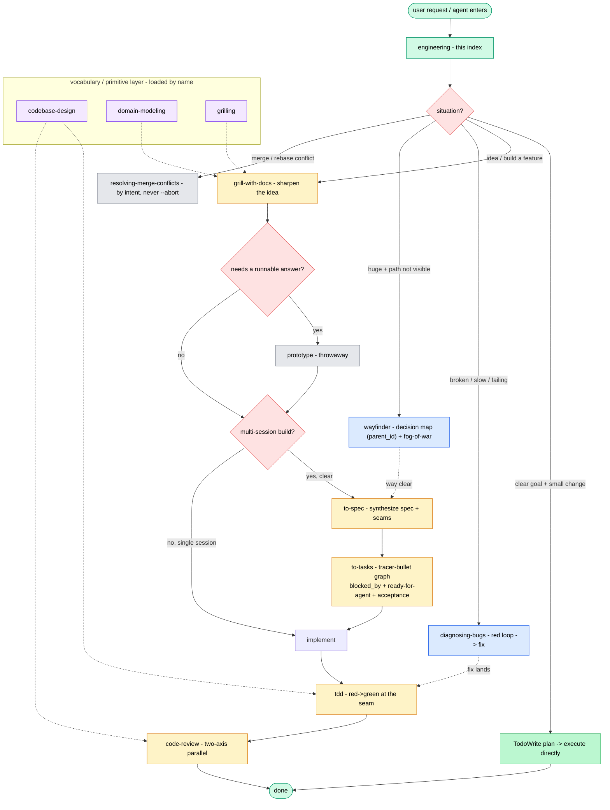

# Engineering Skills — Index

This is the index and router for Somnia's engineering skills — the catalog, the
routing map, and the context rules. All skills live under this bundle; load any
with `load_skill <name>` (or `/skill <name>`). Read the map to pick one.

## Trivial path — clear goal, small change

If the user's goal is unambiguous **and** the change is small (a single focused
edit, a one-off fix, a tiny addition), skip the skill machinery — lay out a short
plan with `TodoWrite` and execute it directly. The flows below add discipline, not
ceremony; prefer this path for small clear tasks.

## Catalog

| skill | what it does | composes with |
|---|---|---|
| `grill-with-docs` | relentless interview to sharpen an idea; writes `CONTEXT.md`/ADRs | `grilling`, `domain-modeling` |
| `to-spec` | synthesize the conversation into a spec + decide the testing seams | → `to-tasks` |
| `to-tasks` | break a spec into a tracer-bullet task graph (`blocked_by`, `ready-for-agent`, `acceptance`) | → `implement` |
| `implement` | claim a task; drive `tdd` → `code-review` → `task_close` → commit | `tdd`, `code-review` |
| `tdd` | red→green loop at pre-agreed seams | `codebase-design` |
| `code-review` | two-axis review (Standards + Spec) via parallel subagents | — |
| `diagnosing-bugs` | red-loop discipline → fix → regression test | → `tdd` |
| `wayfinder` | decision-task map (`parent_id`) for huge, foggy efforts | → `to-spec` when clear |
| `prototype` | throwaway code answering one design question | — |
| `resolving-merge-conflicts` | merge/rebase conflicts hunk-by-hunk by intent; never `--abort` | — |
| `codebase-design` | deep-module vocabulary (module/interface/seam/depth) | reference |
| `domain-modeling` | ubiquitous language, `CONTEXT.md`, ADRs | reference |
| `grilling` | one-question-at-a-time interview primitive | reference |

## The map

## How to use

Load the skill you need with `load_skill <name>` (or `/skill <name>`); the map above
routes by situation.

## Context hygiene

Keep the grilling → spec → tasks steps in **one unbroken context window** (don't
compact or clear until after `to-tasks`), so the spec and the task graph build on
the same thinking. Each `implement` then starts fresh from its task. At any phase
boundary the move is, in order: **Continue** (if the next phase needs this one as
primary source) → `/clear` (if disposable) → handoff/subagent → `/compact`
(default, but last resort).
